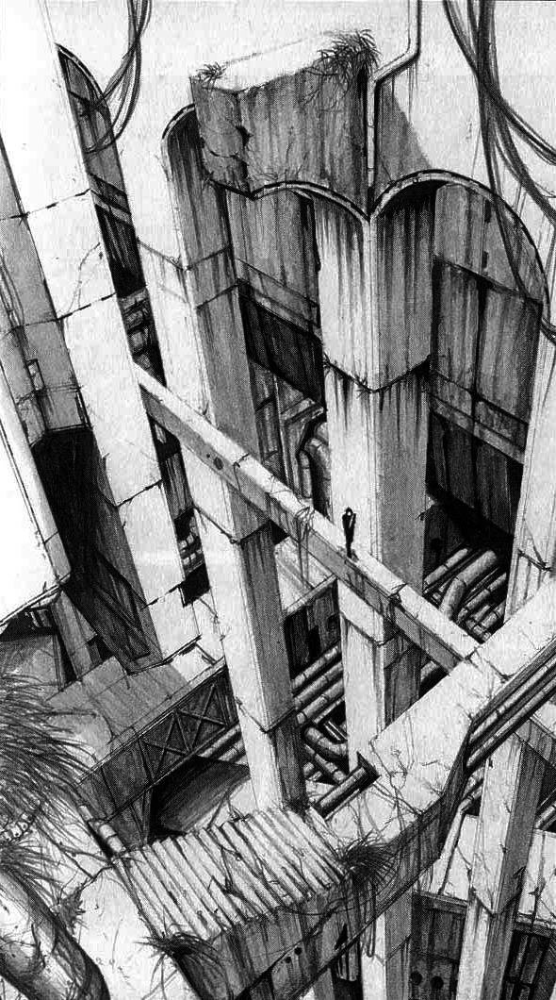
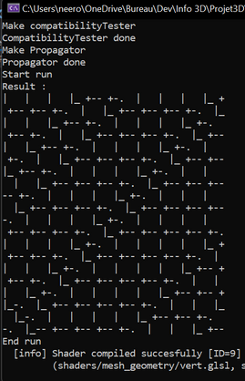
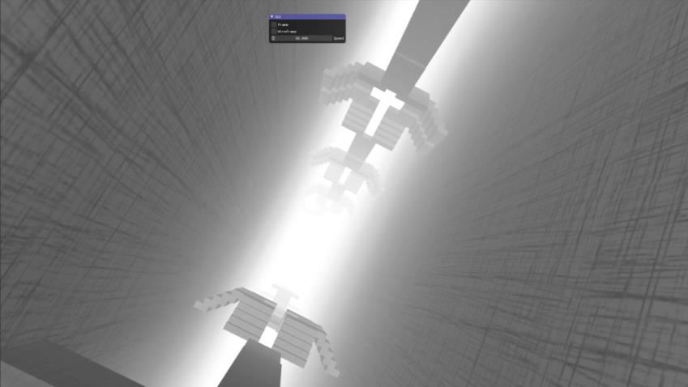
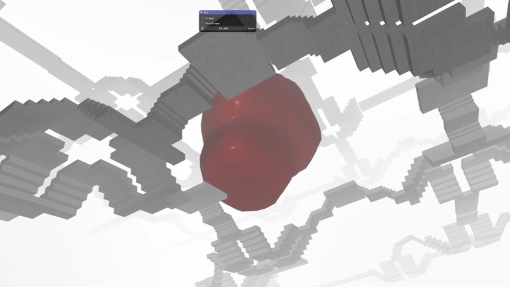

# Computer graphics project - The Megastructure by El khalifi Omar and Marie Louise Communal 

This project is a procedurally generated openGL scene consisting in several interlocking rooms traversed by stairs and bridges. It was made as part of a course on computer graphics in early 2022.

The inspiration for this scene comes from the works of MC Escher and Tsutomu Nihei.

It is generated using three main methods:

## 1. Wave Function Collapse

The Wave Function Collapse algorithm is used to create a tiling on a grid using elements called modules, which have compatibility rules between them. The algorithm operates in two phases:

- The first phase iterates over all the cells of the grid to find the cell that minimizes Shannon's entropy (i.e., the cell where the choice of a permitted module has the least consequences). A module is then drawn from the available modules according to their weights.
- Once this cell is determined, the "propagate" function is applied, which recursively propagates the consequences of the choice of the previous module to adjacent cells.
- The algorithm ends when all cells are determined, i.e., when the "coefficients" array only contains arrays of size 1.

That way, each time, a 3D structure is generated from the 2D procedurally generated grid

## 2. Fog Shader

To enhance the feeling of being lost in a huge structure, fog is implemented using shaders. A white value is added to the final color depending on the distance, creating a fog effect.

## 3. Center Piece

### 3.1) Dynamic Spring Simulation

At the center of the structure is a levitating viscous fluid that beats like a heart. This effect is achieved using blobs. Five masses connected by springs give the position of the centers of the blob functions.

### 3.2) Blinn Metaballs/Implicit Surfaces

A smooth evolving implicit surface is traced at each frame from the 5 center masses. The surface is defined by the sum of 3D gaussians, which provide a smooth combination of the 5 balls.

### 3.3) Marching Cubes

The marching cubes algorithm is used to generate a mesh from the implicit surface to render it through the standard pipeline. It creates a smooth surface by interpolating between the values of the implicit surface at the corners of each cube in the grid. This method is costly to run in real time for each frame, but we use a low rendering resolution to keep a high framerate.

## Future Improvements

The camera can be improved, but its current implementation allows a feeling of floating and makes it easier to notice the symmetry of the scene. In addition, some 3D models made on Blender have bad UVs and some inverted normals.

To go further, the algorithm can be extended to a 3D grid, and the number of modules can be increased, see https://marian42.de/article/wfc/ for 100 modules and infinite 3d world generation

This project was made possible with Damien Rohmer's cgp library https://github.com/drohmer/cgp
